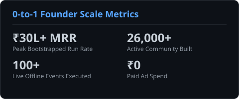
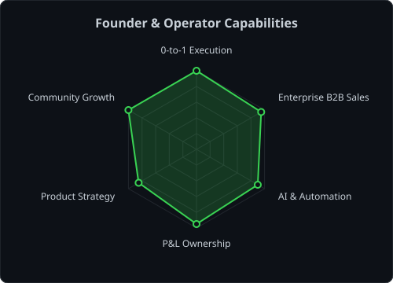
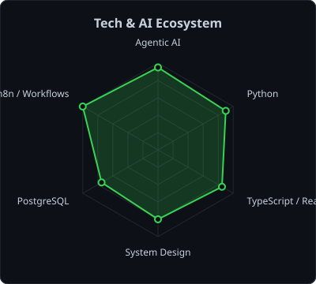
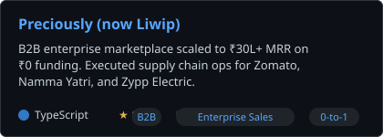
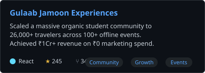
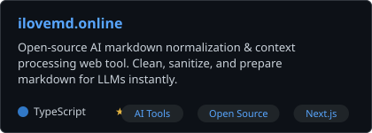
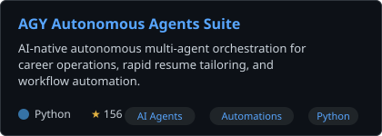

<div align="center">

<!-- HERO REVEAL - Animated Dot-Matrix Portrait -->


<br>

<!-- DYNAMIC TYPEWRITER BANNER -->
<a href="https://github.com/ChawlaBhai">
  
</a>

<br>

<!-- SOCIALS HUD -->
<a href="https://linkedin.com/in/13sahajchawla"></a>
<a href="mailto:sahajsadhu@gmail.com"></a>
<a href="https://x.com/13SahajChawla"></a>
<a href="https://sahaj.ilovemd.online"></a>
<a href="https://github.com/ChawlaBhai"></a>


</div>

---

## `~/` whoami

```console
$ chawla --profile --fast
```

Hi, I'm **Sahaj Chawla**. I'm a 2x bootstrapped founder and AI-native product builder. I specialize in 0-to-1 execution, taking operations from high-burn chaos to highly profitable, scalable ecosystems. I build products, negotiate enterprise deals, and orchestrate autonomous AI agents. 

- 🚀 Co-Founded **Preciously (now Liwip)** — Scaled B2B enterprise marketplace to **₹30L+ MRR** (Zomato, Zypp, Namma Yatri).
- ⛺ Co-Founded **Gulaab Jamoon (now WeekOff)** — Scaled experiential community to **26,000+** students and 100+ events on **₹0 marketing spend**.
- 🧠 Creator of **[iLoveMd.online](https://ilovemd.online)** — 100% On-browser Local AI Markdown Conversions & LLM Context Processor with Chrome Extension.
- ⚙️ Deeply obsessed with **Multi-Agent Orchestration, n8n automations, and turning ₹1Cr+ burns into profitable ecosystems**.

> *"Generalist at heart, even the caste category is General. Low ego, zero delegation, bias to ship fast."*

<br>

<div align="center">

## `~/` toolbox


</div>

---

<div align="center">

## `~/` founder metrics & telemetry

<table>
<tr>
<td width="50%" align="center" valign="middle">

<!-- Founder Dashboard -->
<picture>
  <source media="(prefers-color-scheme: dark)" srcset="assets/card-founder-dark.svg">
  <source media="(prefers-color-scheme: light)" srcset="assets/card-founder-light.svg">
  
</picture>

</td>
<td width="50%" align="center" valign="middle">

<!-- GitHub Stats Dashboard -->
<a href="https://github.com/ChawlaBhai">
  
</a>

</td>
</tr>
</table>

</div>

---

<div align="center">

## `~/` radar & architecture

<table>
<tr>
<td width="50%" align="center" valign="middle">

<!-- Competency Radar -->
<picture>
  <source media="(prefers-color-scheme: dark)" srcset="assets/radar-skills-dark.svg">
  <source media="(prefers-color-scheme: light)" srcset="assets/radar-skills-light.svg">
  
</picture>

</td>
<td width="50%" align="center" valign="middle">

<!-- Tech Radar -->
<picture>
  <source media="(prefers-color-scheme: dark)" srcset="assets/radar-tech-dark.svg">
  <source media="(prefers-color-scheme: light)" srcset="assets/radar-tech-light.svg">
  
</picture>

</td>
</tr>
</table>

</div>

---

<div align="center">

## `~/` live deployments & open-source

<table>
<tr>
<td width="50%" align="center">
  <a href="https://www.liwip.com/">
    <picture>
      <source media="(prefers-color-scheme: dark)" srcset="assets/card-PreciousLy-dark.svg">
      <source media="(prefers-color-scheme: light)" srcset="assets/card-PreciousLy-light.svg">
      
    </picture>
  </a>
</td>
<td width="50%" align="center">
  <a href="https://weekoff.in/">
    <picture>
      <source media="(prefers-color-scheme: dark)" srcset="assets/card-GulaabJamoon-dark.svg">
      <source media="(prefers-color-scheme: light)" srcset="assets/card-GulaabJamoon-light.svg">
      
    </picture>
  </a>
</td>
</tr>
<tr>
<td width="50%" align="center">
  <a href="https://ilovemd.online/">
    <picture>
      <source media="(prefers-color-scheme: dark)" srcset="assets/card-ilovemd.online-dark.svg">
      <source media="(prefers-color-scheme: light)" srcset="assets/card-ilovemd.online-light.svg">
      
    </picture>
  </a>
</td>
<td width="50%" align="center">
  <a href="https://chawlabhai.github.io/JobHunterOP/">
    <picture>
      <source media="(prefers-color-scheme: dark)" srcset="assets/card-Career-Ops-dark.svg">
      <source media="(prefers-color-scheme: light)" srcset="assets/card-Career-Ops-light.svg">
      
    </picture>
  </a>
</td>
</tr>
</table>

</div>

---

<div align="center">

## `~/` contribution graph

<!-- Live Github Contributions Chart -->
<a href="https://github.com/ChawlaBhai">
  
</a>

</div>

---

<div align="center">

<sub>`01000001 01100001 01110000 00100000 01100010 01100001 01110011 00100000 01101011 01100001 01100001 01101101 00100000 01100100 01101111 00101100 00100000 01101011 01100001 01110010 01101011 01100101 00100000 01100100 01100101 01101110 01100001 00100000 01101101 01100101 01110010 01100001 00100000 01101011 01100001 01100001 01101101 00100000 01101000 01100001 01101001 00101110`</sub>

</div>
